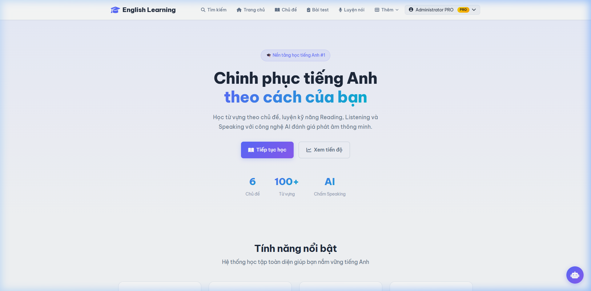
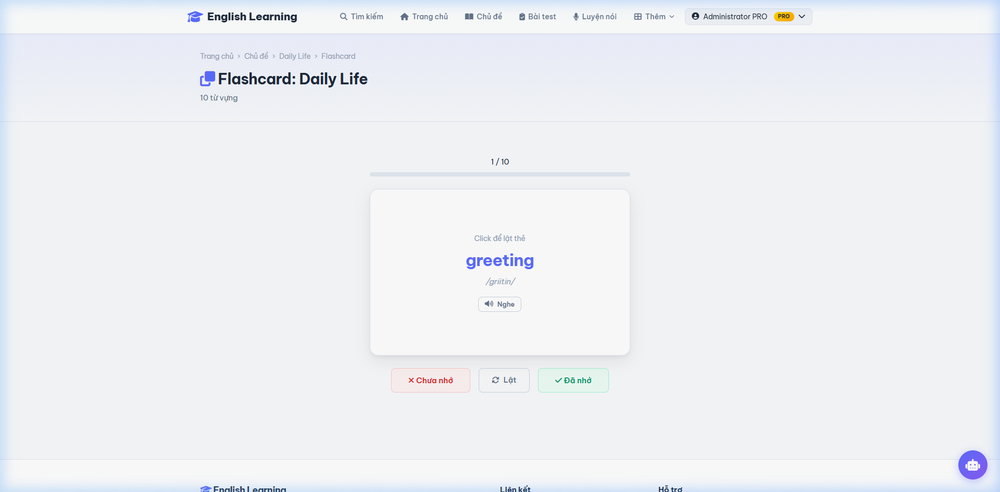
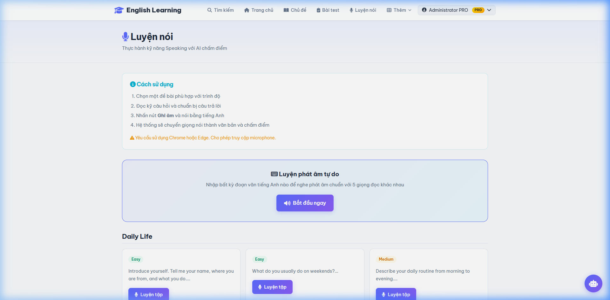
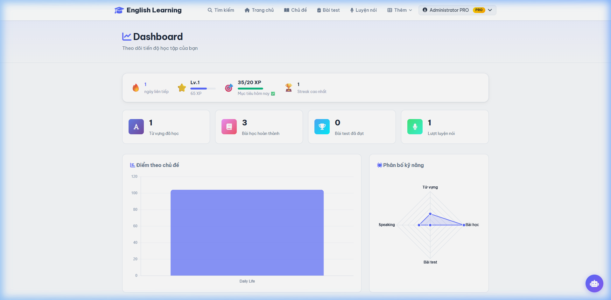
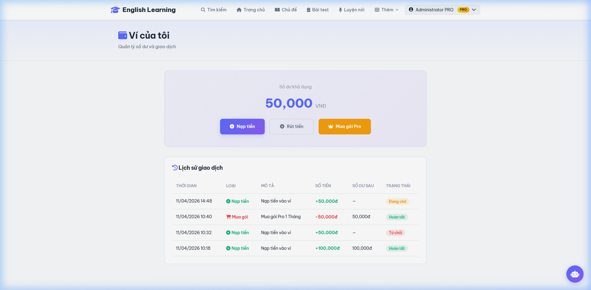
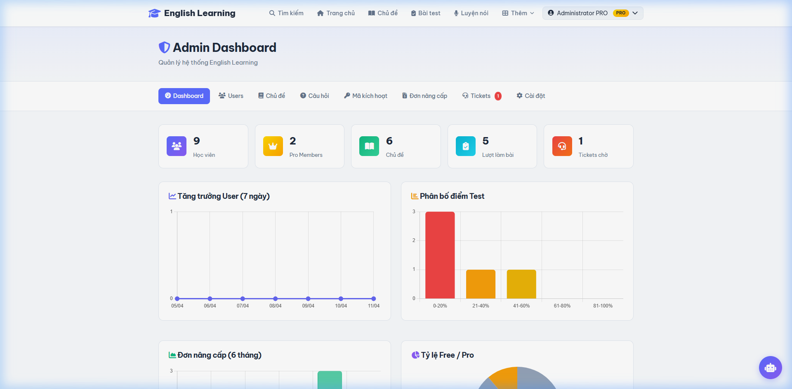

# 🎓 English Learning — Website Học Tiếng Anh Trực Tuyến

> **Đồ án thực tập tốt nghiệp** — Trường Cao đẳng Công Thương TPHCM  
> GVHD: Vũ Thị Hường | SVTH: Phan Quang Thuật (2120110351)


### 🌐 Live Demo: [https://englishlearning.gt.tc](https://englishlearning.gt.tc)

---

## 📋 Giới thiệu

**English Learning** là nền tảng học tiếng Anh trực tuyến toàn diện, hỗ trợ người dùng học qua nhiều kỹ năng: **Từ vựng, Ngữ pháp, Nghe, Đọc, Nói**. Đặc biệt, hệ thống tích hợp **AI (OpenAI GPT)** để đánh giá kỹ năng nói và cung cấp phản hồi chi tiết.

### ✨ Tính năng nổi bật

| Tính năng | Mô tả |
|---|---|
| 📚 **Học từ vựng** | 6 chủ đề, flashcard lật, bookmark |
| 📝 **Bài kiểm tra** | Quiz, Listening (Pro), Reading (Pro) |
| 🗣️ **Luyện nói AI** | Ghi âm → AI chấm điểm Pronunciation/Fluency/Accuracy |
| 📖 **Ngữ pháp** | 10 bài ngữ pháp + quiz thực hành |
| 💰 **Ví điện tử** | Nạp tiền QR, mua gói Pro, rút tiền, hoàn tiền |
| 🏆 **Gamification** | XP, Level, Streak, Leaderboard, Daily Goal |
| 🎫 **Membership** | Free / Pro với mã kích hoạt hoặc thanh toán ví |
| 🎧 **Hỗ trợ** | Ticket system, hủy đơn + hoàn tiền tự động |
| 🔐 **Bảo mật** | Google OAuth 2.0, transaction locking, password hashing |

---

## 🛠️ Công nghệ sử dụng

| Layer | Công nghệ |
|---|---|
| **Backend** | PHP 8.2 (MVC thuần), PDO |
| **Database** | MySQL 8.0, InnoDB, utf8mb4 |
| **Frontend** | HTML5, CSS3, JavaScript (ES6), AJAX |
| **API** | Google OAuth 2.0, OpenAI GPT, Web Speech API, VietQR |
| **Charts** | Chart.js |
| **Server** | Apache (XAMPP) |

---

## 🚀 Hướng dẫn cài đặt

### Yêu cầu hệ thống
- [XAMPP](https://www.apachefriends.org/) (PHP 8.2+, MySQL 8.0+, Apache)
- Trình duyệt: Chrome hoặc Edge (cần cho Web Speech API)

### Bước 1: Clone dự án

```bash
cd C:\xampp\htdocs
git clone https://github.com/sylarbear/DA_TTTN.git
```

### Bước 2: Import Database

1. Mở **phpMyAdmin**: http://localhost/phpmyadmin
2. Tạo database mới: `english_master` (charset: `utf8mb4_general_ci`)
3. Import file: `database/english_master_full.sql`

Hoặc dùng command line:
```bash
mysql -u root -e "CREATE DATABASE IF NOT EXISTS english_master CHARACTER SET utf8mb4 COLLATE utf8mb4_general_ci;"
mysql -u root english_master < database/english_master_full.sql
```

### Bước 3: Cấu hình

1. Copy file env mẫu:
```bash
cp app/config/env.example.php app/config/env.php
```

2. Mở `app/config/env.php` và điền thông tin:
```php
define('GOOGLE_CLIENT_ID', 'your_google_client_id');
define('GOOGLE_CLIENT_SECRET', 'your_google_client_secret');
```

3. (Tùy chọn) Chỉnh `app/config/database.php` nếu cần đổi user/password MySQL.

### Bước 4: Chạy

1. Khởi động **Apache** và **MySQL** trong XAMPP Control Panel
2. Truy cập: **http://localhost/DA_TTTN/public/**

### Tài khoản mẫu

| Role | Username | Password |
|---|---|---|
| **Admin** | `admin` | `admin123` |
| **User (Pro)** | `student1` | `123456` |
| **User (Free)** | `student2` | `123456` |

---

## 🌐 Demo trực tuyến

🔗 **Website**: [https://englishlearning.gt.tc](https://englishlearning.gt.tc)

### Hướng dẫn test nhanh

1. **Truy cập** [https://englishlearning.gt.tc](https://englishlearning.gt.tc)
2. **Đăng nhập** với tài khoản demo:
   - Admin: `admin` / `admin123`
   - Student: `student1` / `123456`

### Các tính năng có thể test

| # | Tính năng | Cách test |
|---|---|---|
| 1 | 📚 **Học từ vựng** | Chủ đề → chọn topic → xem từ vựng, click "Đã học" |
| 2 | 🃏 **Flashcard** | Chủ đề → chọn topic → tab "Flashcard" → lật thẻ |
| 3 | 📖 **Bài học** | Chủ đề → chọn topic → tab "Bài học" |
| 4 | 📝 **Làm bài test** | Bài test → chọn quiz → làm bài → xem kết quả |
| 5 | 📗 **Ngữ pháp** | Thêm → Ngữ pháp → xem bài → làm quiz |
| 6 | 🎤 **Luyện nói** | Luyện nói → chọn bài → ghi âm (cần Chrome) |
| 7 | 📊 **Dashboard** | Thêm → Dashboard → xem thống kê học tập |
| 8 | 🏆 **Xếp hạng** | Thêm → Xếp hạng → bảng xếp hạng XP |
| 9 | 🔖 **Bookmark** | Thêm → Từ đã lưu → quản lý từ bookmark |
| 10 | 💰 **Ví điện tử** | Thêm → Ví của tôi → xem số dư, lịch sử |
| 11 | 💎 **Mua gói Pro** | Thêm → Quản lý Pro → mua gói membership |
| 12 | 🎧 **Hỗ trợ** | Thêm → Hỗ trợ → tạo ticket mới |
| 13 | ⚙️ **Admin Panel** | Đăng nhập admin → Admin Panel → quản lý hệ thống |

> **Lưu ý**: Tính năng Luyện nói AI cần microphone và trình duyệt Chrome/Edge.
> Google OAuth chưa được cấu hình trên bản demo.

---

## 📁 Cấu trúc dự án

```
DA_TTTN/
├── app/
│   ├── config/          # Cấu hình (app, database, env)
│   ├── controllers/     # Controllers (Auth, Wallet, Membership, Admin...)
│   ├── core/            # Core framework (App, Controller, Middleware, StreakService)
│   ├── models/          # Models (User, Topic, Test, Vocabulary...)
│   └── views/           # Views theo module
│       ├── admin/       #   Trang quản trị
│       ├── auth/        #   Đăng nhập, đăng ký
│       ├── grammar/     #   Ngữ pháp
│       ├── layouts/     #   Header, Footer
│       ├── membership/  #   Nâng cấp Pro
│       ├── wallet/      #   Ví điện tử
│       └── ...
├── database/
│   ├── schema.sql              # Schema gốc
│   ├── english_master_full.sql # Full dump (schema + data mẫu)
│   └── migration_v*.sql        # Các migration
├── docs/
│   ├── bao_cao_thuc_tap.docx   # Báo cáo tốt nghiệp
│   ├── slide_bao_ve.pptx       # Slide trình bày
│   ├── uml_diagrams.md/.docx   # Sơ đồ UML
│   ├── wireframe.md/.docx      # Wireframe + screenshots
│   └── screenshots/            # 30 screenshots giao diện
├── public/
│   ├── index.php        # Entry point
│   ├── css/             # Stylesheets
│   ├── js/              # JavaScript
│   └── uploads/         # File upload
└── .gitignore
```

---

## 📊 Database Schema

**23 bảng** — chia thành 4 nhóm chính:

| Nhóm | Bảng | Mô tả |
|---|---|---|
| **Học tập** | topics, vocabularies, lessons, tests, questions, grammar_lessons, speaking_prompts | Nội dung học |
| **Người dùng** | users, user_progress, bookmarks, test_results, xp_history, lesson_reviews | Dữ liệu user |
| **Tài chính** | membership_plans, membership_orders, wallet_transactions, activation_codes | Thanh toán |
| **Hỗ trợ** | support_tickets | Ticket hỗ trợ |

---

## 📸 Screenshots

| Trang chủ | Flashcard | Luyện nói AI |
|---|---|---|
|  |  |  |

| Dashboard | Ví điện tử | Admin |
|---|---|---|
|  |  |  |

---

## 📄 Tài liệu

| File | Mô tả |
|---|---|
| [bao_cao_thuc_tap.docx](docs/bao_cao_thuc_tap.docx) | Báo cáo thực tập tốt nghiệp |
| [slide_bao_ve.pptx](docs/slide_bao_ve.pptx) | Slide trình bày (20 slides) |
| [uml_diagrams.md](docs/uml_diagrams.md) | Sơ đồ UML (Mermaid) |
| [wireframe.md](docs/wireframe.md) | Wireframe + screenshots |

---

## 👨‍💻 Tác giả

**Phan Quang Thuật**  
MSSV: 2120110351 | Lớp: CCQ2011E | Khóa: K44  
Trường Cao đẳng Công Thương TPHCM  
GVHD: Vũ Thị Hường

---

## 📝 License

Dự án này được phát triển cho mục đích học tập (đồ án thực tập tốt nghiệp).
