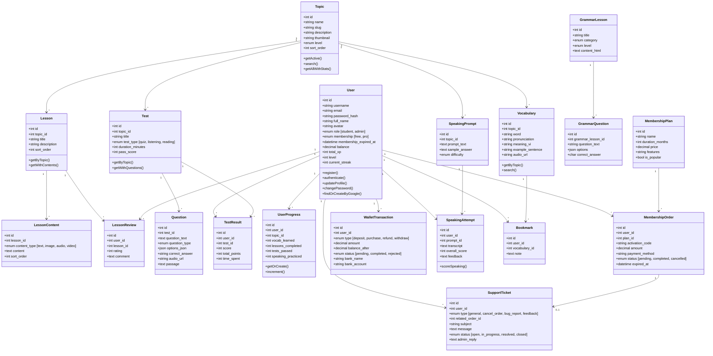
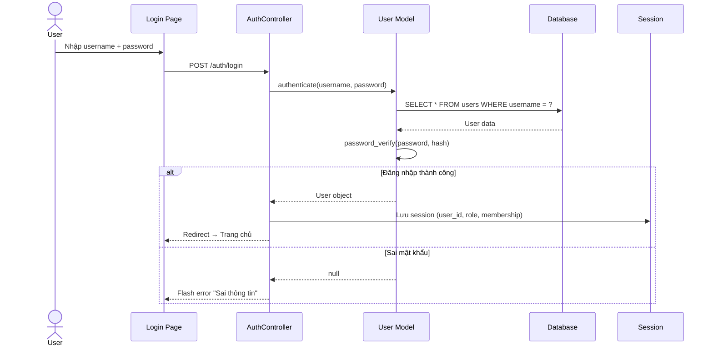
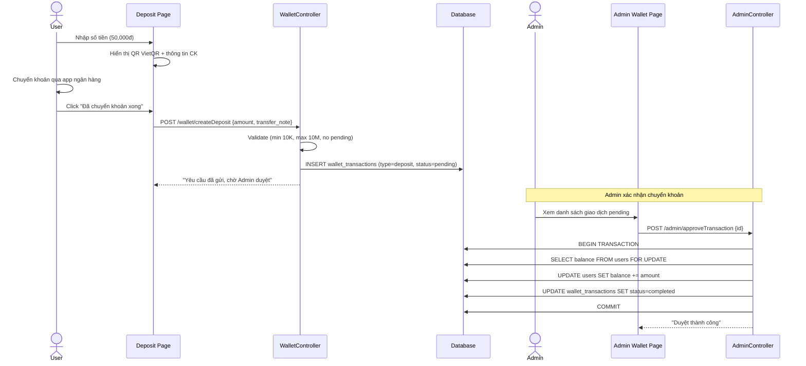
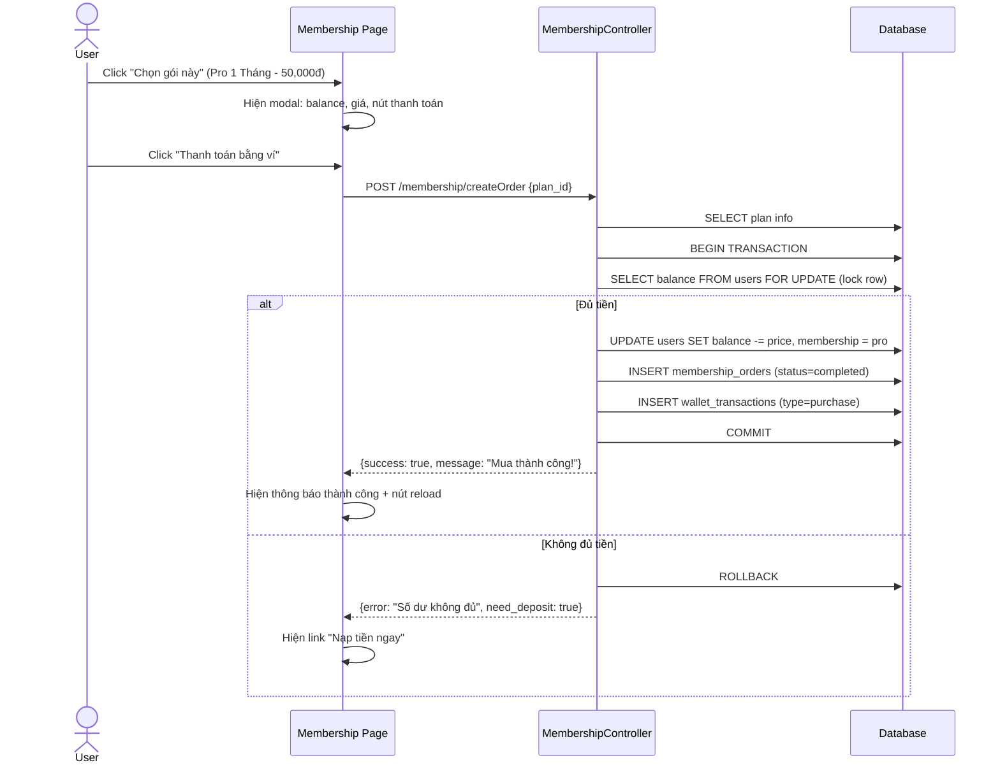
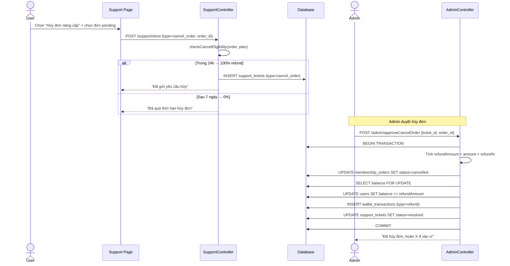
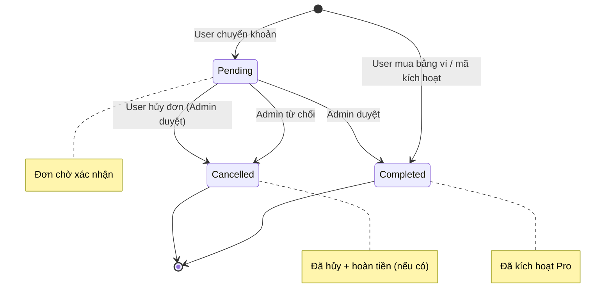
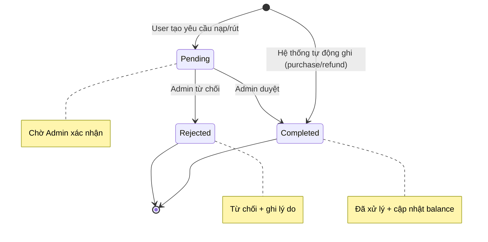
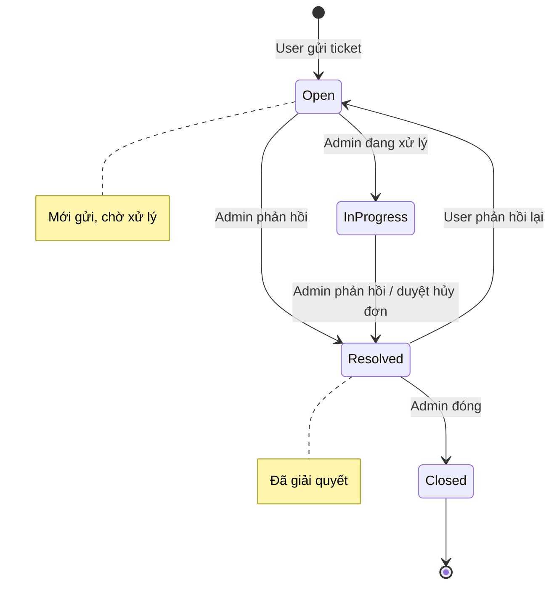
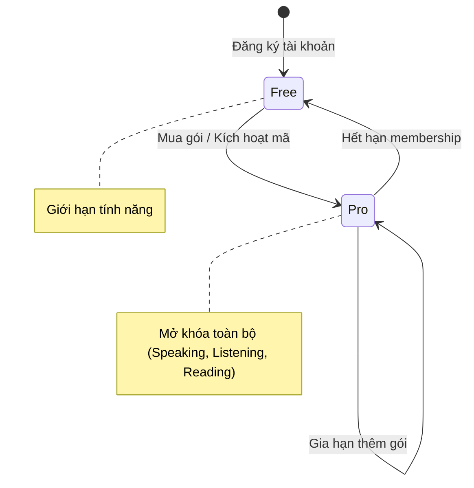

# Phân tích hệ thống EnglishMaster — UML Diagrams

---

## 1. Use Case Diagram

```mermaid
graph TB
    subgraph Hệ thống EnglishMaster
        UC1["Đăng ký / Đăng nhập"]
        UC2["Đăng nhập Google OAuth"]
        UC3["Xem chủ đề từ vựng"]
        UC4["Học bài (Lesson)"]
        UC5["Học Flashcard"]
        UC6["Làm bài test Quiz"]
        UC7["Làm bài Listening"]
        UC8["Làm bài Reading"]
        UC9["Luyện nói Speaking"]
        UC10["Học Ngữ pháp"]
        UC11["Đánh giá bài học"]
        UC12["Bookmark từ vựng"]
        UC13["Tìm kiếm từ vựng"]
        UC14["Xem Dashboard tiến độ"]
        UC15["Xem Leaderboard"]
        UC16["Nâng cấp Pro"]
        UC17["Nạp tiền vào ví"]
        UC18["Mua gói bằng ví"]
        UC19["Rút tiền từ ví"]
        UC20["Kích hoạt mã"]
        UC21["Gửi ticket hỗ trợ"]
        UC22["Yêu cầu hủy đơn"]
        UC23["Quản lý Users"]
        UC24["Quản lý Chủ đề"]
        UC25["Quản lý Câu hỏi"]
        UC26["Quản lý Mã kích hoạt"]
        UC27["Duyệt đơn nâng cấp"]
        UC28["Duyệt giao dịch ví"]
        UC29["Quản lý Tickets"]
        UC30["Duyệt hủy đơn + Hoàn tiền"]
        UC31["Cài đặt hệ thống"]
    end

    Guest(("👤 Khách"))
    User(("👨‍🎓 User"))
    Pro(("⭐ Pro User"))
    Admin(("🔧 Admin"))

    Guest --> UC1
    Guest --> UC2
    Guest --> UC3
    
    User --> UC3
    User --> UC4
    User --> UC5
    User --> UC6
    User --> UC10
    User --> UC11
    User --> UC12
    User --> UC13
    User --> UC14
    User --> UC15
    User --> UC16
    User --> UC17
    User --> UC18
    User --> UC19
    User --> UC20
    User --> UC21
    User --> UC22

    Pro --> UC7
    Pro --> UC8
    Pro --> UC9
    
    Admin --> UC23
    Admin --> UC24
    Admin --> UC25
    Admin --> UC26
    Admin --> UC27
    Admin --> UC28
    Admin --> UC29
    Admin --> UC30
    Admin --> UC31
```

> [!NOTE]
> **Actors:** Guest (chưa đăng nhập), User (đã đăng nhập - Free), Pro User (hội viên Pro), Admin (quản trị viên).
> Pro User kế thừa tất cả quyền của User. Admin kế thừa tất cả quyền của Pro User.

---

## 2. Class Diagram

---

## 3. Sequence Diagrams

### 3.1. Đăng nhập

### 3.2. Nạp tiền vào ví

### 3.3. Mua gói Pro bằng ví

### 3.4. Hủy đơn + Hoàn tiền

---

## 4. State Diagrams

### 4.1. Trạng thái Đơn hàng (Membership Order)

### 4.2. Trạng thái Giao dịch Ví (Wallet Transaction)

### 4.3. Trạng thái Support Ticket

### 4.4. Trạng thái User Membership

