# Thiết kế giao diện — EnglishMaster

## Danh sách trang và chức năng

---

## I. Giao diện Người dùng (Student)

### 1. Đăng nhập
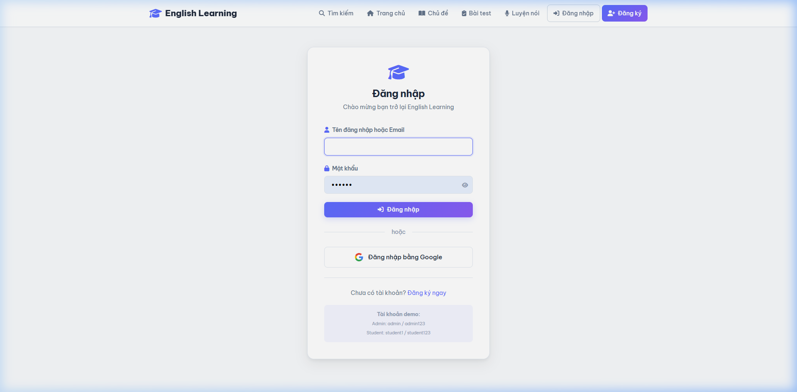
- Form đăng nhập username/password
- Nút đăng nhập bằng Google OAuth 2.0
- Link đăng ký tài khoản mới

### 2. Trang chủ

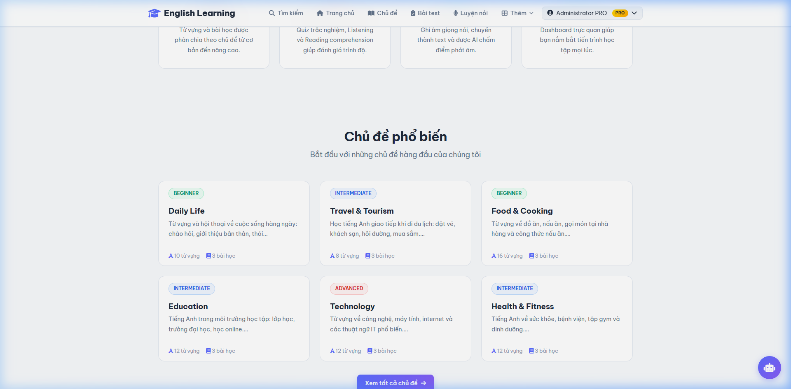
- Banner giới thiệu
- Thống kê nhanh (số chủ đề, bài học, quiz)
- Danh sách chủ đề học nổi bật
- Footer với links

### 3. Danh sách chủ đề
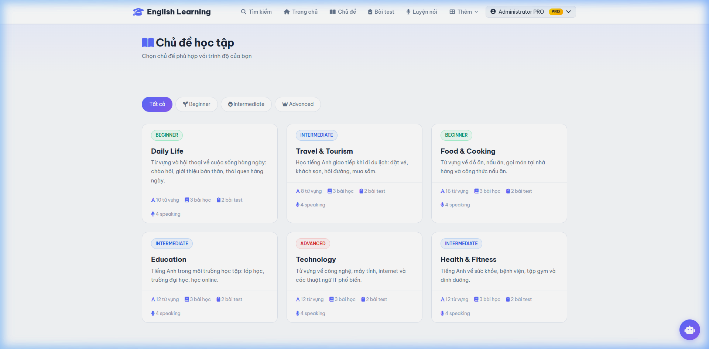
- Grid các chủ đề theo level (Beginner, Intermediate, Advanced)
- Hiển thị thumbnail, tên, mô tả
- Badge level màu sắc

### 4. Chi tiết chủ đề
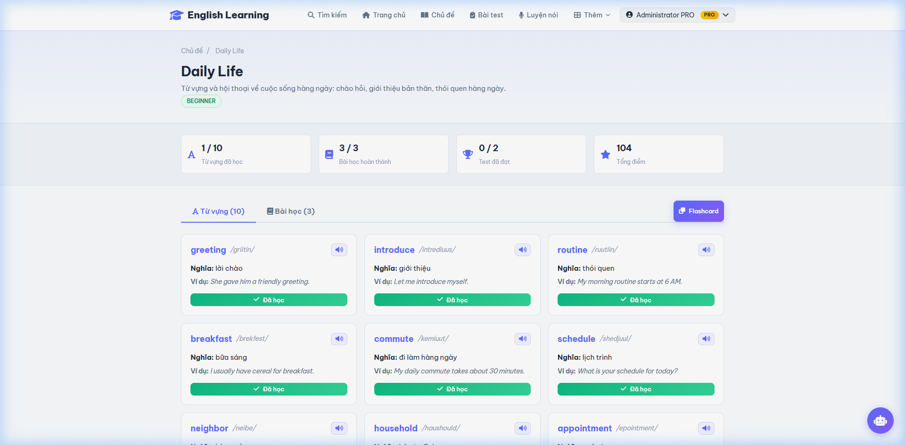
- Thông tin chủ đề
- Danh sách từ vựng (word, nghĩa, phát âm, ví dụ)
- Nút học Flashcard, làm bài test
- Danh sách bài học

### 5. Bài học
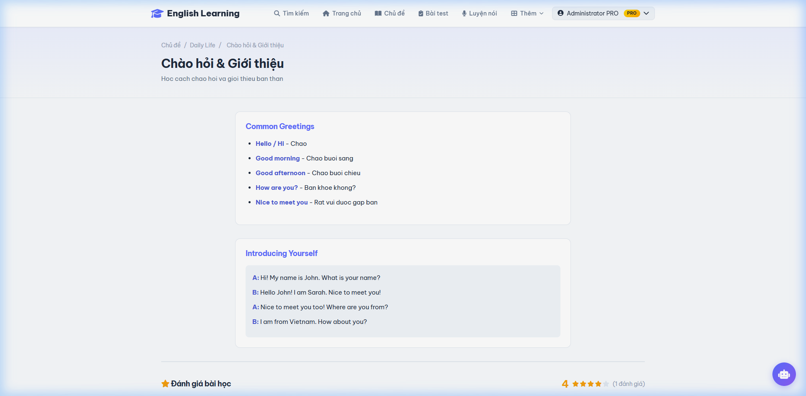
- Nội dung bài học (text, hình ảnh, audio, video)
- Breadcrumb navigation
- Nút Next/Previous lesson
- Phần đánh giá bài học (rating sao + nhận xét)

### 6. Flashcard

- Card lật (flip) hiển thị từ vựng
- Mặt trước: từ tiếng Anh + phát âm
- Mặt sau: nghĩa tiếng Việt + ví dụ
- Nút Previous/Next, nút Bookmark

### 7. Ngữ pháp
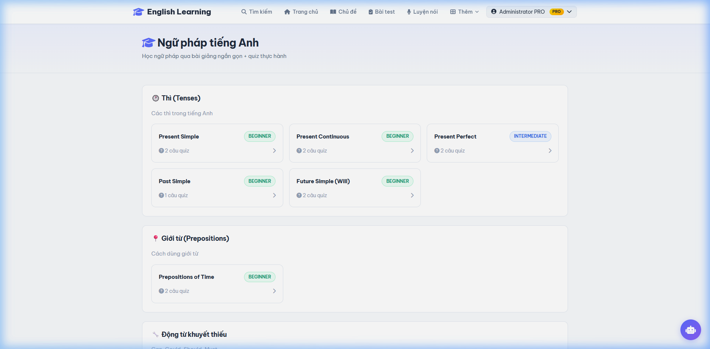
- Phân loại theo chủ đề (Tenses, Prepositions, Modals...)
- Badge level cho từng bài
- Số câu quiz mỗi bài

### 8. Bài kiểm tra (Test)
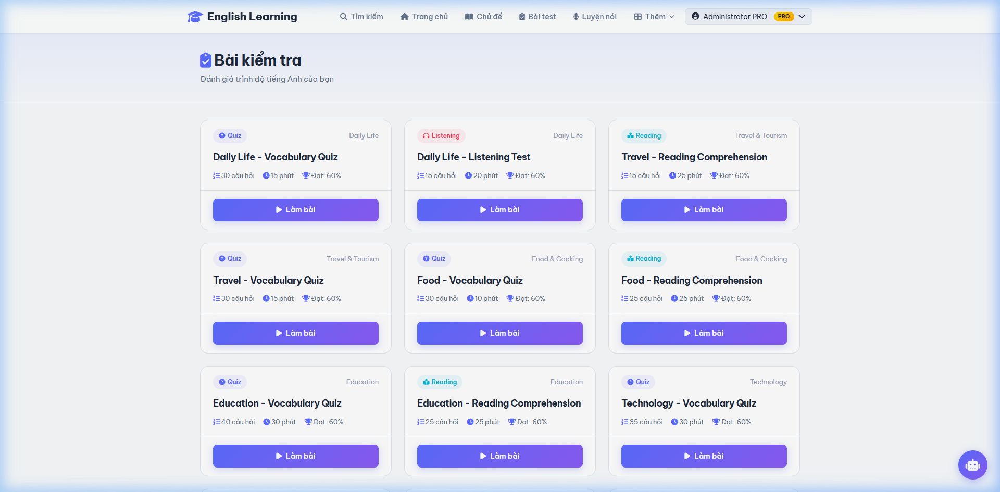
- Danh sách bài test theo chủ đề
- Phân loại: Quiz, Listening (Pro), Reading (Pro)
- Hiển thị thời gian, số câu, điểm đạt
- Badge PRO cho tính năng nâng cao

### 9. Luyện nói (Speaking)

- Chọn chủ đề luyện nói
- Ghi âm giọng nói
- AI chấm điểm: Pronunciation, Fluency, Accuracy
- Feedback chi tiết từ AI

### 10. Dashboard

- Thống kê tiến độ học tập
- Streak (chuỗi ngày học liên tiếp)
- XP và Level
- Biểu đồ tiến độ theo chủ đề

### 11. Bảng xếp hạng
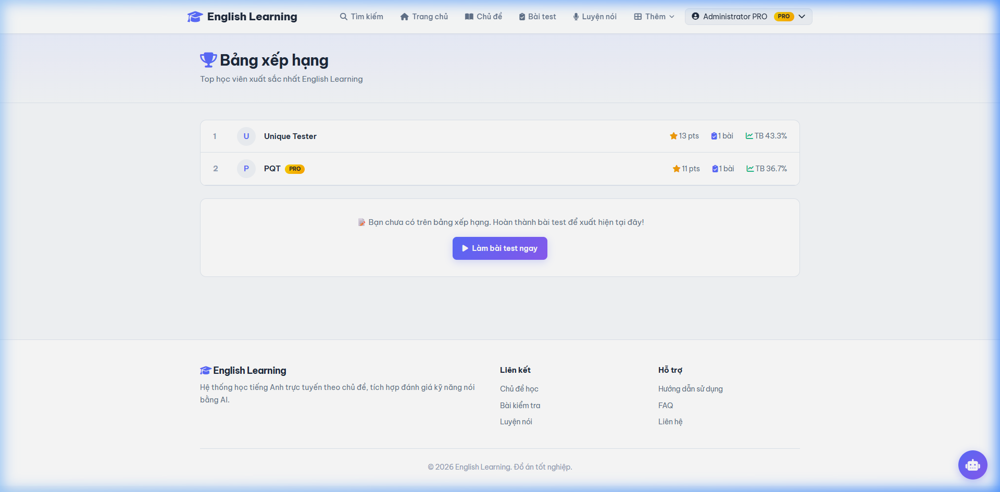
- Top users theo XP
- Hiển thị avatar, tên, level, streak
- Highlight vị trí hiện tại của user

### 12. Bookmark
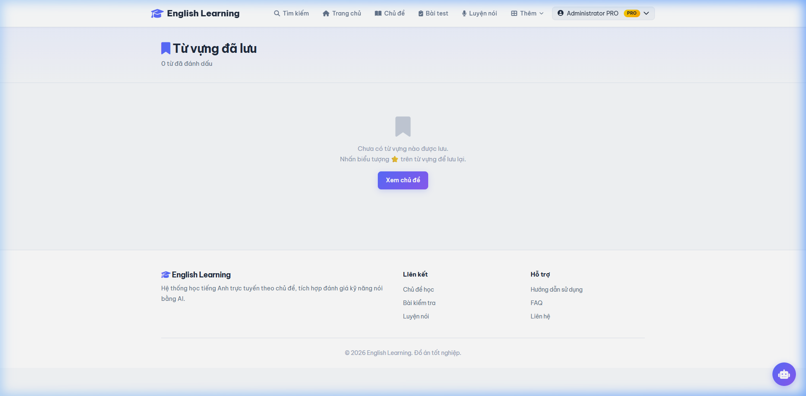
- Danh sách từ vựng đã lưu
- Nút xóa bookmark
- Ghi chú cá nhân

### 13. Hồ sơ cá nhân
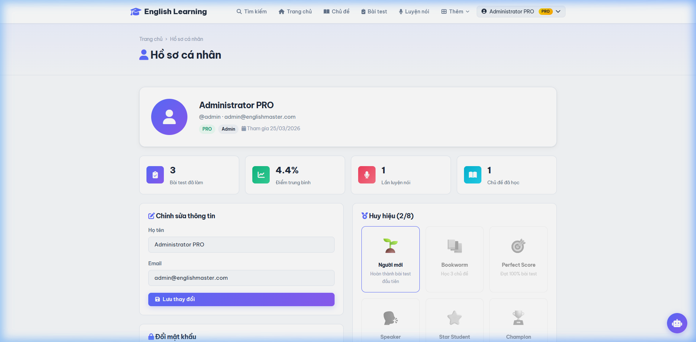
- Thông tin tài khoản
- Upload/đổi avatar
- Đổi mật khẩu
- Trạng thái membership

### 14. Ví điện tử

- Hiển thị số dư
- Nút Nạp tiền, Rút tiền, Mua gói Pro
- Lịch sử giao dịch (bảng chi tiết)

### 15. Nạp tiền
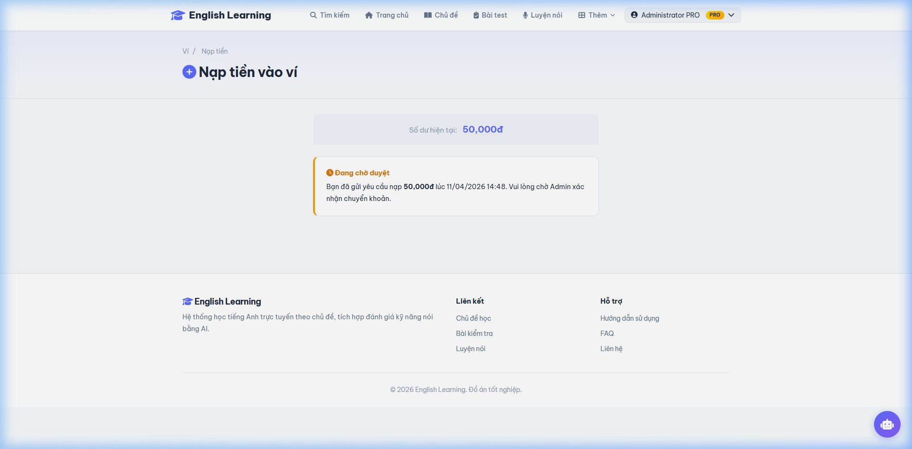
- Nhập số tiền (quick buttons: 50K, 100K, 200K, 500K)
- Hiển thị QR code VietQR tự động
- Thông tin chuyển khoản (STK, chủ TK, nội dung CK)
- Nút xác nhận đã chuyển khoản

### 16. Rút tiền
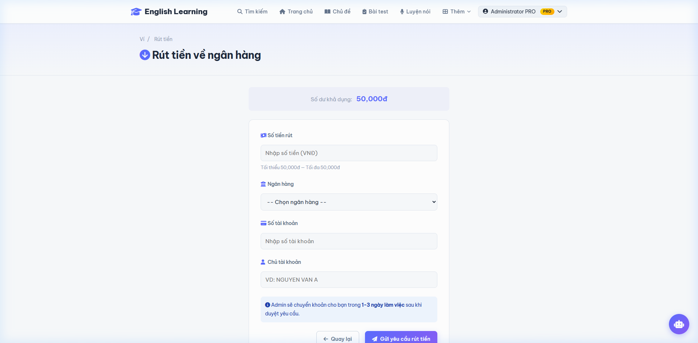
- Form nhập số tiền rút
- Chọn ngân hàng (VCB, TCB, BIDV, MBBank...)
- Nhập STK + tên chủ tài khoản
- Thông báo thời gian xử lý 1-3 ngày

### 17. Nâng cấp Pro
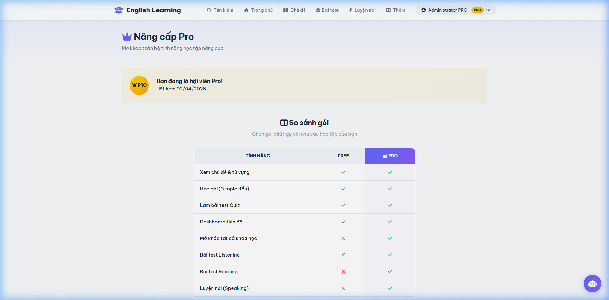
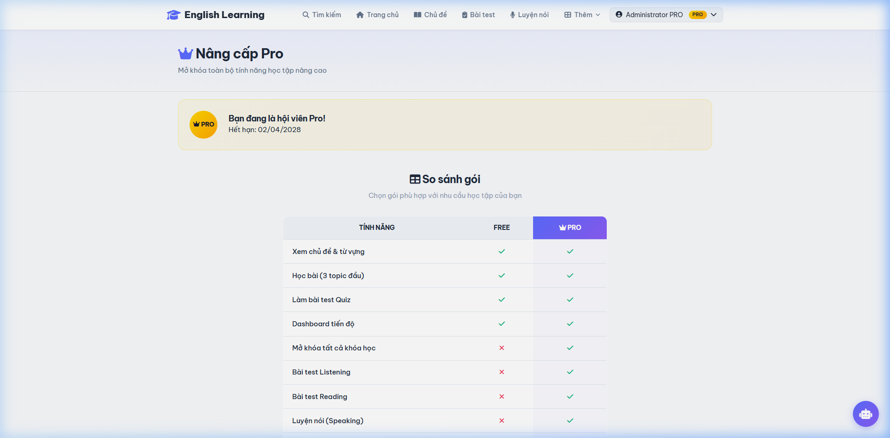
- So sánh tính năng Free vs Pro
- Bảng giá 3 gói: 1 tháng, 3 tháng, 12 tháng
- Badge "PHỔ BIẾN NHẤT"
- Modal thanh toán bằng ví
- Lịch sử đơn hàng + nút hủy đơn

### 18. Hỗ trợ
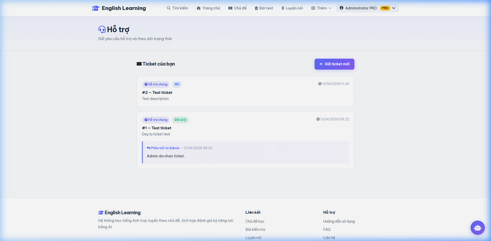
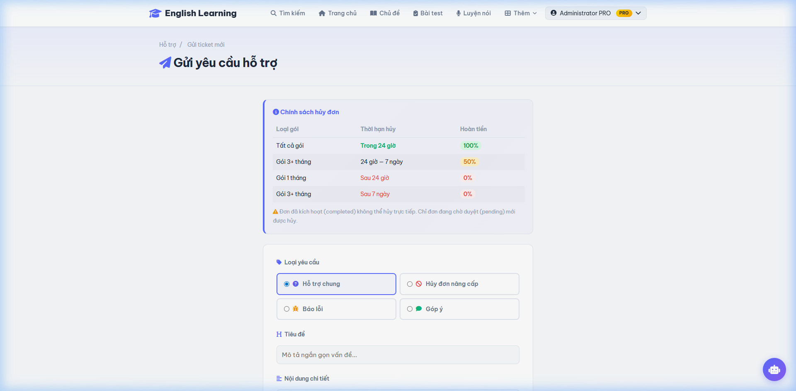
- Danh sách ticket đã gửi (trạng thái: Mở, Đang xử lý, Đã xử lý)
- Form tạo ticket mới (Hỗ trợ chung, Hủy đơn, Báo lỗi, Góp ý)
- Hiển thị phản hồi Admin

---

## II. Giao diện Quản trị (Admin)

### 19. Dashboard Admin

- Thống kê tổng quan: Users, Pro Members, Chủ đề, Lượt làm bài, Tickets
- Biểu đồ tăng trưởng user (7 ngày)
- Biểu đồ phân bố điểm test
- Biểu đồ đơn nâng cấp (6 tháng)
- Biểu đồ tỷ lệ Free/Pro

### 20. Quản lý Users
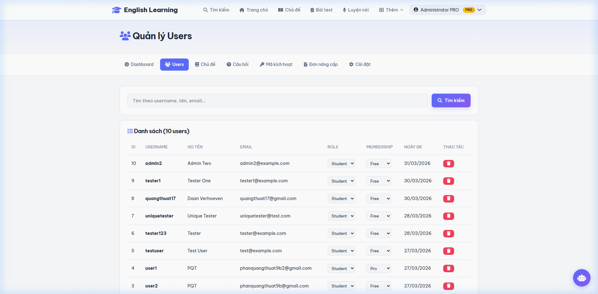
- Danh sách tất cả users
- Tìm kiếm user
- Sửa thông tin, đổi role, ban/unban

### 21. Quản lý Chủ đề
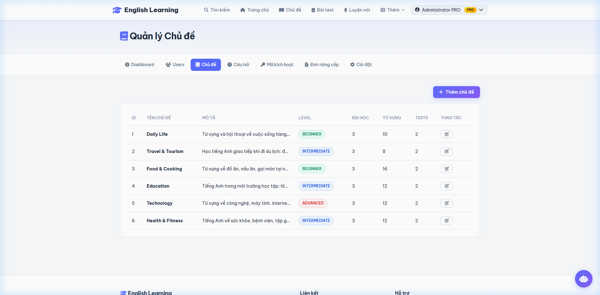
- CRUD chủ đề học
- Sắp xếp thứ tự
- Bật/tắt active

### 22. Quản lý Câu hỏi
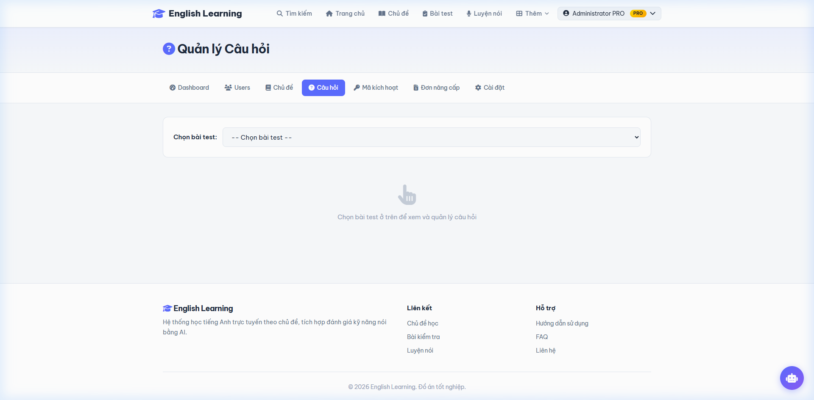
- Danh sách câu hỏi theo bài test
- CRUD câu hỏi (multiple choice, true/false, fill blank)

### 23. Quản lý Mã kích hoạt
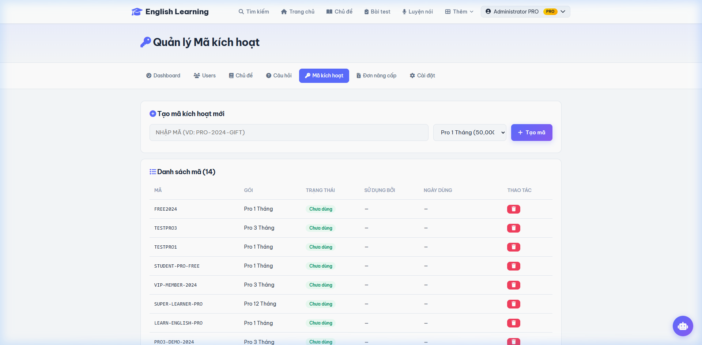
- Tạo mã kích hoạt Pro
- Danh sách mã (đã dùng / chưa dùng)

### 24. Quản lý Đơn nâng cấp
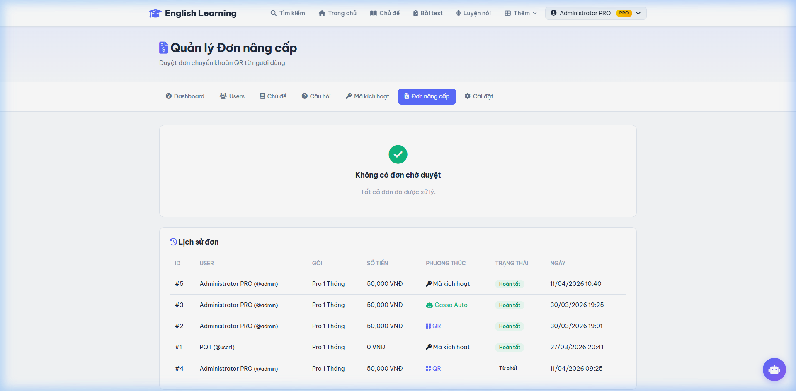
- Danh sách đơn hàng membership
- Duyệt / Từ chối đơn pending

### 25. Quản lý Tickets
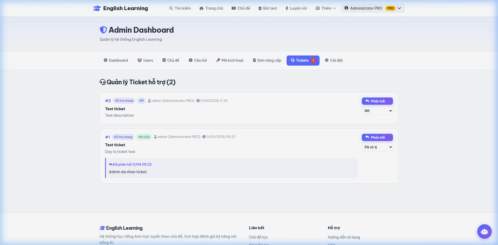
- Danh sách tất cả tickets
- Phản hồi ticket
- Duyệt hủy đơn + hoàn tiền tự động
- Thay đổi trạng thái

### 26. Quản lý Ví
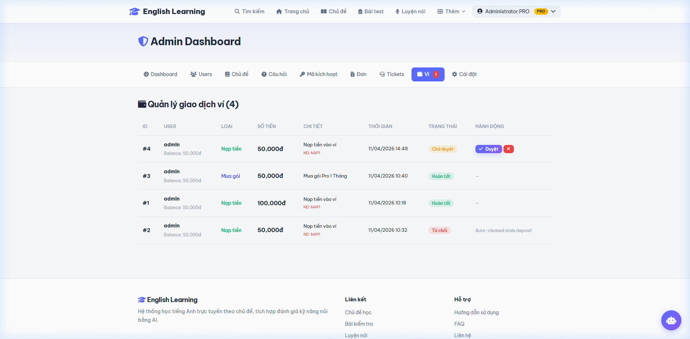
- Danh sách giao dịch ví (nạp/rút/mua/hoàn)
- Duyệt / Từ chối giao dịch pending
- Hiển thị thông tin ngân hàng (cho lệnh rút)

### 27. Cài đặt hệ thống
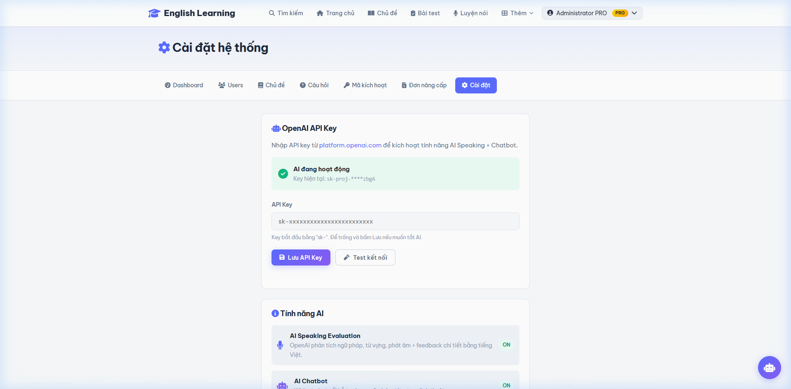
- Cấu hình hệ thống
- Quản lý các tham số
